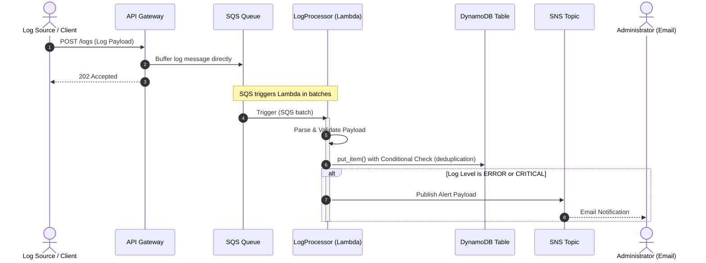
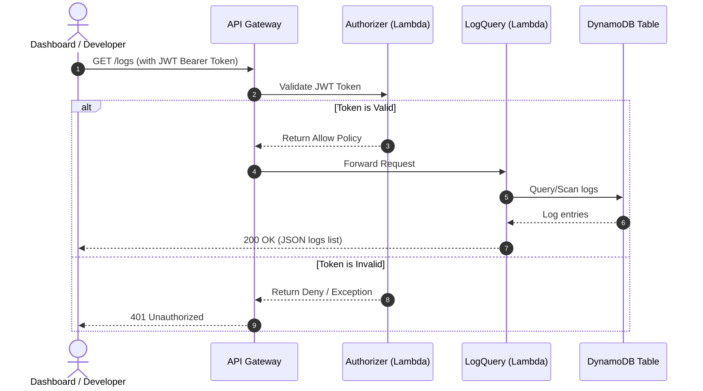
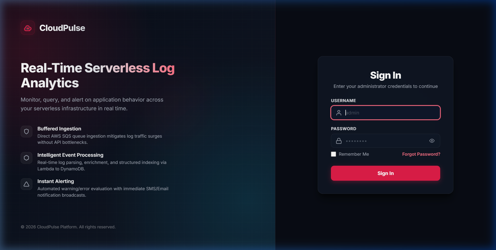
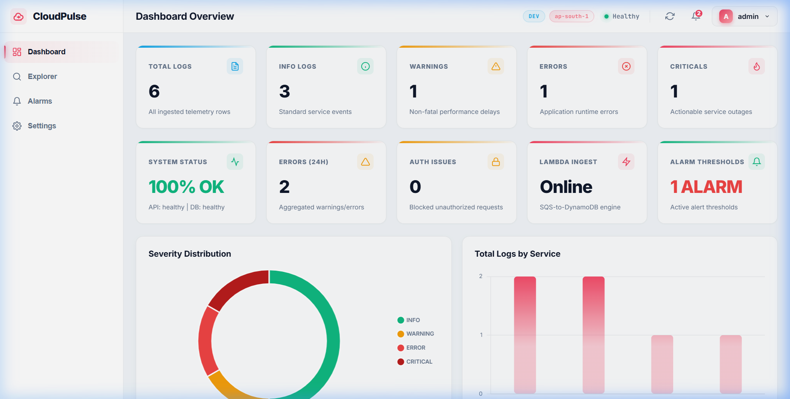
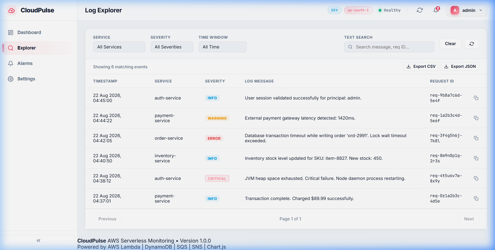
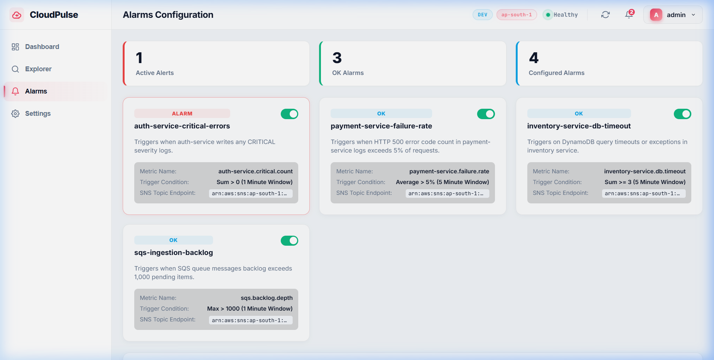

# CloudPulse

> **Serverless Real-Time Log Analytics & Intelligent Alerting Platform on AWS**

[](https://github.com/Manobala27/Cloudpulse/actions/workflows/ci-cd.yml)
[](https://github.com/Manobala27/Cloudpulse/actions/workflows/codeql-analysis.yml)
[](https://www.python.org/)
[](https://aws.amazon.com/serverless/sam/)

CloudPulse is an enterprise-grade, high-performance, cost-optimized serverless log ingestion, storage, search, and intelligent alerting platform built entirely on AWS. It is designed to handle surges in high-velocity log traffic using SQS buffers, store logs in partitioned DynamoDB tables, process messages in real-time with Python Lambda functions, emit Custom EMF Metrics, trigger SNS alerts on critical issues, and present real-time telemetry on an authenticated dashboard.

---

## 1. Project Overview

Modern cloud architectures demand highly available, horizontally scalable, and cost-efficient observability solutions. CloudPulse implements an asynchronous ingestion pipeline pattern that decouples API ingest from backend processing, ensuring backend databases or compute nodes are never overwhelmed during traffic spikes. 

### Key Capabilities:
* **Decoupled Asynchronous Ingestion**: Uses Amazon API Gateway integrated directly with Amazon SQS to buffer spikes in incoming traffic without degrading ingestion performance.
* **Intelligent Telemetry Processing**: Processes log batches using Lambda, validates schemas, dedupes requests using a conditional expression in DynamoDB, and logs events using standard structured JSON formats.
* **Intelligent Observability Alerts**: Automatically evaluates ingested logs and issues email notifications via Amazon SNS when `ERROR` or `CRITICAL` levels are met.
* **Lightweight JWT Auth**: Protects administrative endpoints using a custom API Gateway Lambda Authorizer checking standard JSON Web Tokens.
* **Production-Grade DevOps Pipelines**: Multi-stage CI/CD workflow utilizing AWS SAM validation, Python tests, styling validation (Black/Ruff), frontend validation, and automatic deployment.

---

## 2. Architecture Overview

### Log Ingestion & Processing Flow

The following Mermaid diagram illustrates the end-to-end data flow:



### Log Query & Auth Flow



---

## 3. AWS Services Used & Rationale

* **Amazon API Gateway**: Serves as the secure entry point. Features direct SQS service integration for asynchronous ingestion, custom token authorizer for route protection, and native CORS mocking.
* **Amazon SQS**: Decouples API Gateway from database writes. Acts as a cost-efficient ingestion buffer that swallows spike traffic and invokes processing Lambdas in batches.
* **AWS Lambda**: Serves as the serverless compute layer.
  * `LoginFunction`: Handles user login and issues JWT tokens.
  * `ApiGatewayAuthorizer`: Inspects HTTP requests, validates signatures, and generates IAM policies dynamically.
  * `LogProcessorFunction`: Consumes SQS logs, runs validation checks, stores records, and issues alerts.
  * `LogQueryFunction`: Retrieves logs filtered by service, level, or returns general logs.
* **Amazon DynamoDB**: Schema-less, highly available NoSQL database. Logs are partitioned using `service_name` as the partition key and `timestamp` as the sort key, allowing fast indexing and querying of service logs.
* **Amazon SNS**: Facilitates event-driven notifications. Automatically dispatches alerts to email subscribers on critical server states.
* **AWS CloudWatch / X-Ray**: Collects Powertools metrics, structured JSON logs, cold start indicators, and executes distributed X-Ray tracing.

---

## 4. Technology Stack

* **Language**: Python 3.12 (Backend Lambdas, pytest, local test scripts), JavaScript/HTML/CSS (Frontend)
* **Framework**: AWS Serverless Application Model (SAM)
* **Backend Libraries**:
  * `boto3`: AWS SDK for Python
  * `aws-lambda-powertools`: Standardized tracing, metrics emission, and structured logging
  * `pyjwt`: JSON Web Token generation and validation
  * `bcrypt`: Secure hashing of credentials
* **Frontend Web**: Vanilla CSS, HTML5, Vanilla JavaScript, Chart.js for real-time charting
* **Testing & Quality Gates**:
  * `pytest`: Unit and integration testing
  * `black`: Uniform code formatting
  * `ruff`: High-speed linting validation

---

## 5. Project Directory Structure

```
├── .github/
│   └── workflows/          # PR validation, CD deployment, and CodeQL scanning
├── backend/
│   ├── src/                # Lambda handlers (login, authorizer, query, processor)
│   │   ├── requirements.txt # Production Lambda dependencies
│   │   └── ...             # Lambda source files
│   └── tests/              # Comprehensive test suites
│       ├── test_auth.py    # Login & Authorizer unit tests
│       ├── test_sns_alerts.py # SNS alert logic tests
│       ├── ...             # DynamoDB storage, generator, & monitoring tests
├── dashboard/              # HTML/CSS/JS single-page monitoring dashboard
│   ├── css/                # Custom style sheets
│   ├── js/                 # API handlers, chart widgets, telemetry UI
│   ├── index.html          # Main telemetry metrics layout
│   └── login.html          # Authentication login page
├── docs/
│   └── modules/            # Detailed step-by-step modular development documentation
├── infrastructure/
│   └── template.yaml       # AWS SAM infrastructure definition
├── local_backend.py        # Local Python mock API Gateway (for development testing)
├── pyproject.toml          # Tooling configurations (Ruff, Black)
├── requirements-dev.txt    # Local development dependencies
└── samconfig.toml          # AWS SAM deployment properties
```

---

## 6. Authentication & Security Flow

* **Hashing**: Passwords are encrypted securely using `bcrypt` check functions.
* **Security Validation**: Custom token authorizers validate Bearer tokens using `HS256` HMAC signatures against a configured `JWT_SECRET` environment variable.
* **API Policy Generation**: Generates explicit AWS IAM Policy documents granting resource access on validated signatures:
  ```json
  {
    "Version": "2012-10-17",
    "Statement": [
      {
        "Action": "execute-api:Invoke",
        "Effect": "Allow",
        "Resource": "arn:aws:execute-api:region:account-id:api-id/stage/*/*"
      }
    ]
  }
  ```

---

## 7. Local Setup & Verification

### Prerequisite Setup
Ensure you have Python 3.12 and Node.js (for frontend lint checks) installed on your system.

1. **Clone the Repository**:
   ```bash
   git clone https://github.com/Manobala27/Cloudpulse.git
   cd Cloudpulse
   ```

2. **Create and Activate Virtual Environment**:
   ```bash
   python -m venv .venv
   # Windows:
   .venv\Scripts\activate
   # Linux/macOS:
   source .venv/bin/activate
   ```

3. **Install Dependencies**:
   ```bash
   pip install -r requirements-dev.txt
   pip install -r backend/src/requirements.txt
   npm install
   ```

4. **Verify Local Health Checks**:
   ```bash
   # Code formatting check
   black --check .
   
   # Python linting
   ruff check .
   
   # Run the full unit/integration test suite
   python -m pytest
   
   # Run frontend HTML, CSS, and JS quality gates
   npm run lint:frontend
   
   # Validate AWS SAM templates
   sam validate --template infrastructure/template.yaml
   sam build --template infrastructure/template.yaml
   ```

---

## 8. Run Locally

### Start Local Mock API Server
To test endpoints locally without deploying to AWS:
```bash
python local_backend.py
```
This runs a local web server mock API on `http://localhost:3000`. You can configure local environment variables such as `JWT_SECRET` and `DYNAMODB_TABLE_NAME` to point to local resources or staging tables.

### Run Dashboard UI
Use a lightweight HTTP server to load the single-page dashboard application:
```bash
cd dashboard
python -m http.server 8000
```
Open your browser and navigate to `http://localhost:8000/login.html`.
* **Username**: `admin`
* **Password**: `password123`

---

## 9. Manual Infrastructure Deployment

To deploy CloudPulse resources manually using the AWS SAM CLI:
```bash
cd infrastructure
sam build
sam deploy --guided
```
Enter parameters for the Environment (`dev` or `prod`), Alert Email address, and JWT secret key when prompted.

---

## 10. CI/CD & DevOps Pipeline

The project implements a zero-trust continuous deployment strategy configured under GitHub Actions:

```yaml
concurrency:
  group: ${{ github.workflow }}-${{ github.ref }}
  cancel-in-progress: true
```

* **Trigger Actions**: Triggers automatically on commits pushed to `main` and `dev` branches, or manual triggering via `workflow_dispatch`.
* **Validation Stage**: Runs Black formatting checks, Ruff lints, `pytest` unit test suites, AWS SAM validation, and frontend JavaScript, CSS, and HTML linting checks in parallel.
* **CD Deployment Stage**: Deploys the built package automatically to AWS if all validations are green and the branch is `main`.

---

## 11. Screenshots

### Login Page

An authenticated portal requiring username and password credentials. It authenticates users against stored hash signatures and issues short-lived JWT authorization tokens.



### Dashboard Overview

The main operational panel displaying real-time telemetry, including active alarms count, log severity status KPIs, service activity charts, and log event tables.



### Log Explorer

A powerful search interface filtering logs dynamically by service origin, severity level, time window, or key-phrase searches.



### Alarms & Monitoring

A dedicated alerting page outlining configured alarm triggers (e.g., JVM memory allocation limits, DB locking, and SQS queue depth backlogs).



---

## 12. Security Considerations
* **No Secret Leakage**: All keys and credentials (such as database name, topic ARNs, and JWT secret keys) are passed as environment variables or SAM configuration overrides, keeping files safe.
* **XSS / Frame Injection Mitigation**: API Gateway and dashboard responses include security headers such as `X-Content-Type-Options: nosniff`, `X-Frame-Options: DENY`, `Content-Security-Policy: default-src 'none'`, and standard `Referrer-Policy: no-referrer`.

---

## 13. Application Integration: CloudVault

CloudPulse actively monitors **CloudVault**, a production cloud file storage and sharing web application.

```
CloudVault Application Events
  (Uploads, Downloads, Deletions, Shares, Logins, Restores)
              │
              ▼
   POST /logs (API Gateway)
              │
              ▼
    Amazon SQS Buffer
              │
              ▼
   AWS Lambda Log Processor
        │           │
        ▼           ▼
  Amazon DynamoDB   Amazon SNS (ERROR/CRITICAL Alerts)
        │
        ▼
CloudPulse Real-Time Dashboard
```

* **Producer**: CloudVault (`app.services.cloudpulse_service.cloudpulse_service`)
* **Consumer**: CloudPulse (`log_processor.py` Lambda via SQS)
* **Storage**: Amazon DynamoDB (`cloudpulse-logs-dev` / `cloudpulse-logs-prod`)
* **Alerting**: Amazon SNS Topic (`cloudpulse-alerts-dev`)

---

## 14. Future Roadmap / Improvements
* **Advanced Slicing and Query Filters**: Implement text/keyword-based search indexation using OpenSearch or DynamoDB query parameter filters.
* **Multi-Factor Authentication**: Shift authentication to AWS Cognito user pools with built-in email verification.
* **Auto-Scaling Log Ingestion**: Configure SQS queue autoscale throttle rates using event source mapping configurations.

---

## License
Licensed under the [MIT License](LICENSE).
Created and maintained for Cloud Engineering and DevOps portfolio reviews.
Last updated: 2026-08-21