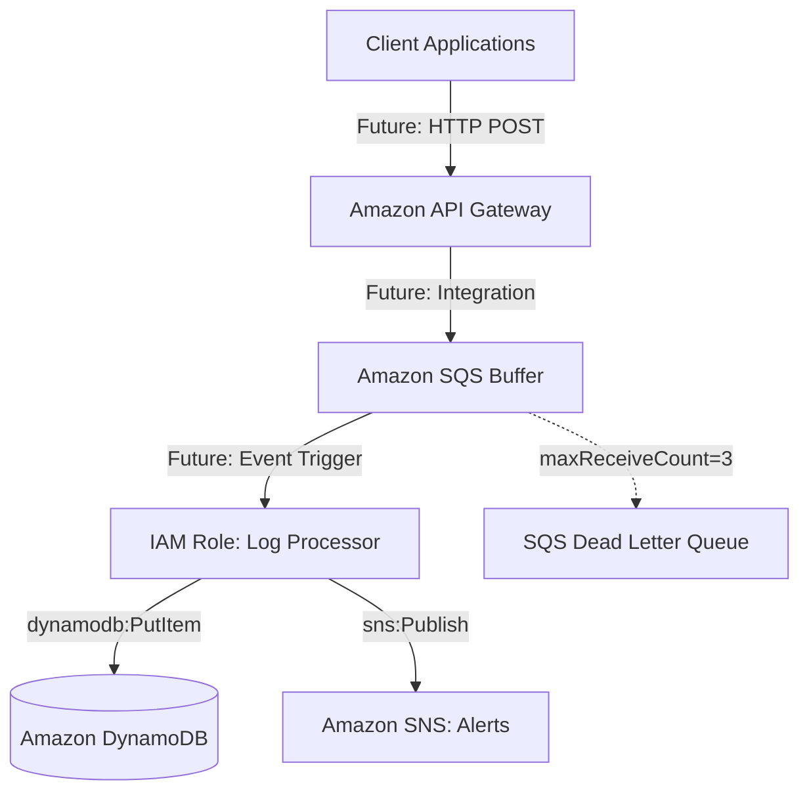

# Module 2: AWS Infrastructure

## Objective
Establish the foundational AWS infrastructure using AWS Serverless Application Model (SAM). This module strictly focuses on provisioning resources via Infrastructure as Code (IaC) without implementing any application logic.

## Architecture

## Resource Explanation

1. **API Gateway (`CloudPulseApi`)**
   * **Purpose:** To serve as the secure HTTP entry point for incoming log requests.
   * **Why it is needed:** It provides throttling, authentication (API Keys in the future), and natively integrates with AWS services without requiring a compute layer.
   * **Security Considerations:** No open endpoints. Will use API keys and usage plans in future modules.
   * **AWS Best Practices:** Defined as `AWS::Serverless::Api` for easy OpenAPI management later. Parameterized stage name.

2. **Dead Letter Queue (`LogProcessingDLQ`)**
   * **Purpose:** To catch malformed or failing log messages.
   * **Why it is needed:** If a log cannot be processed after 3 attempts, it shouldn't block the queue. DLQs prevent infinite processing loops.
   * **Security Considerations:** Access is restricted via IAM.
   * **AWS Best Practices:** Always attach a DLQ to an async processing queue.

3. **Main SQS Queue (`LogProcessingQueue`)**
   * **Purpose:** To act as a buffer between API Gateway and the Log Processor Lambda.
   * **Why it is needed:** Handles sudden spikes in log traffic (backpressure), ensuring downstream services (Lambda/DynamoDB) aren't overwhelmed.
   * **AWS Best Practices:** Configured with a `RedrivePolicy` pointing to the DLQ.

4. **DynamoDB Table (`LogStorageTable`)**
   * **Purpose:** To persistently store structured log data.
   * **Why it is needed:** NoSQL is ideal for high-throughput write workloads like logs.
   * **Security Considerations:** Encrypted at rest by default.
   * **AWS Best Practices:** Uses `PAY_PER_REQUEST` billing mode for cost efficiency. The partition key is `service_name` and sort key is `timestamp` for efficient querying.

5. **SNS Topic (`AlertTopic`)**
   * **Purpose:** To broadcast alerts for critical log events.
   * **Why it is needed:** Pub/Sub model allows multiple subscribers (email, SMS, webhooks) to receive the same alert without modifying publisher code.
   * **AWS Best Practices:** Parameterized email endpoint.

6. **IAM Role (`LogProcessorExecutionRole`)**
   * **Purpose:** Grants the future Log Processor Lambda precise permissions to interact with AWS services.
   * **Why it is needed:** To follow the principle of least privilege.
   * **Security Considerations:** Explicitly scopes `Action` to only what is necessary (`sqs:ReceiveMessage`, `dynamodb:PutItem`, etc.) and restricts `Resource` to exactly the ARNs created in this stack.
   * **AWS Best Practices:** Uses inline policies attached to a strict AssumeRole policy.

## Testing
* **SAM Validation:** Run `sam validate` to ensure YAML syntax and CloudFormation intrinsic functions are correct. (Passed)

## Completion Checklist
- [x] Initialized `template.yaml`.
- [x] Created `parameters.json`.
- [x] Configured all requested AWS resources.
- [x] Implemented Least Privilege IAM.
- [x] Parameterized resource names.
- [x] Documented resources in this file.
- [x] Validated template.
