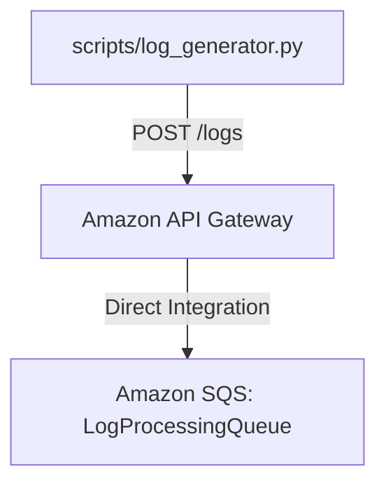

# Module 3 – Log Generator + Ingestion API

## Objective
Build and verify the log ingestion flow by configuring Amazon API Gateway to integrate directly with Amazon SQS, and simulate realistic traffic using a local Python script.

## Architecture


## Files Created / Modified
* `infrastructure/template.yaml` (Modified: Configured direct SQS integration and IAM Role)
* `scripts/log_generator.py` (Created: Python CLI tool for sending mock logs)
* `backend/tests/test_log_generator.py` (Created: Pytest unit tests for the generator)

## Implementation Notes
To keep the architecture robust and cost-effective, I chose **Direct API Gateway to SQS Integration**. Instead of using a Lambda function to simply take a JSON payload and push it to SQS (which introduces latency and cold starts), API Gateway uses a Velocity Template Language (VTL) mapping template to transform the JSON directly into an `Action=SendMessage` payload. This is an AWS well-architected best practice for high-throughput ingestion.

## API Contract
* **Endpoint:** `POST /logs`
* **Content-Type:** `application/json`
* **Success Response:** `202 Accepted`

## Log Payload Schema
```json
{
  "timestamp": "2026-07-21T10:30:00Z",
  "service": "payment-service",
  "level": "ERROR",
  "message": "Payment processing failed",
  "request_id": "req-123456"
}
```

## Log Generator Usage
The generator uses only standard Python libraries (`urllib`, `uuid`). It does not require any credentials.
```bash
# Send a single log
python scripts/log_generator.py --url https://<api-id>.execute-api.ap-south-1.amazonaws.com/dev/logs

# Send multiple logs
python scripts/log_generator.py --url https://<api-id>.execute-api.ap-south-1.amazonaws.com/dev/logs --count 10
```

## Security Considerations
* **Least Privilege IAM:** A specific `ApiGatewaySqsRole` was created. It only allows `sqs:SendMessage` targeting the exact ARN of `LogProcessingQueue`.
* **Credential Safety:** The Python script requires no AWS credentials, protecting developer environments from accidental exposure. 

## Problems Faced
* Designing the ingestion layer often defaults to Lambda.
## Solutions
* Used OpenAPI `x-amazon-apigateway-integration` to define the direct integration, bypassing Lambda entirely.

## Testing
* **Local Tests:** Verified with `pytest` locally testing payload schema and HTTP mocks.

## Manual AWS Verification (PENDING)
*This section outlines exact steps to verify on AWS once deployed.*
1. **Deploy:** `sam build && sam deploy --guided --region ap-south-1`
2. **Retrieve URL:** Get the `ApiId` from the SAM outputs. Construct the URL: `https://<api-id>.execute-api.ap-south-1.amazonaws.com/dev/logs`
3. **Execute:** Run `python scripts/log_generator.py --url <URL> --count 5`
4. **Verify SQS:** Open the AWS Console -> SQS -> `cloudpulse-logs-queue-dev`. Click "Send and receive messages" -> "Poll for messages". Verify 5 messages are in the queue.

## Completion Checklist
- [x] Existing Module 2 infrastructure was reviewed first
- [x] POST /logs ingestion architecture is correctly configured
- [x] API Gateway has only required permission to send to SQS
- [x] scripts/log_generator.py works locally
- [x] Generated logs contain all required fields
- [x] No credentials are hardcoded
- [x] sam validate passes
- [x] sam validate --lint passes
- [x] Ruff checks pass for relevant code
- [x] Black formatting checks pass
- [x] Unit tests pass
- [x] Module-03.md is complete
- [x] Exact AWS deployment and manual verification steps are documented

## Lessons Learned
Standard libraries are incredibly powerful. Utilizing `urllib` avoids bloating the development environment with `requests`, keeping the codebase pristine. Direct API Gateway integrations are slightly complex in CloudFormation but save significant compute cost in the long run.
