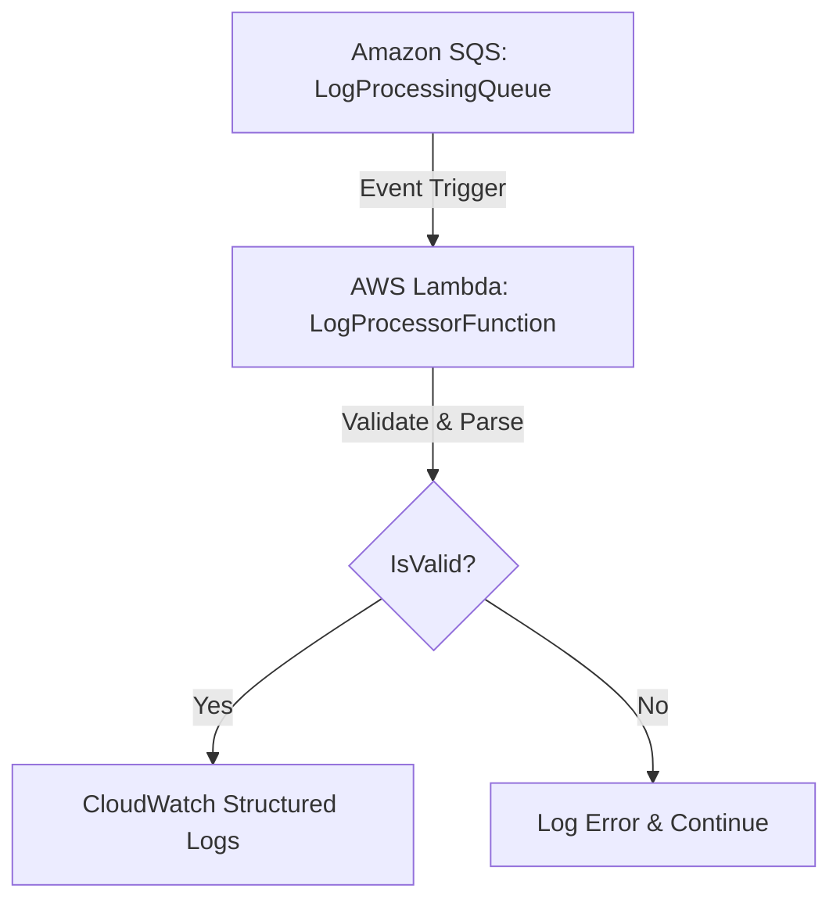

# Module 4 – Log Processing Lambda

## Objective
Build a production-quality AWS Lambda function that automatically triggers from the SQS queue, validates incoming JSON logs, and writes structured logs to CloudWatch. Crucially, it must handle malformed logs gracefully without failing the entire SQS batch.

## Architecture

## Files Created
* `backend/src/log_processor.py` (Lambda handler)
* `backend/tests/test_log_processor.py` (Unit tests)
* `docs/modules/Module-04.md` (This documentation)

## Files Modified
* `infrastructure/template.yaml` (Added `LogProcessorFunction` and SQS event mapping)

## Lambda Flow
1. **Trigger:** The function is invoked by an SQS event containing a batch of messages.
2. **Iterate:** It loops through each record in `event['Records']`.
3. **Parse:** Attempts to parse the message body as JSON.
4. **Validate:** Checks for required fields (`timestamp`, `service`, `level`, `message`, `request_id`) and ensures `level` is within the accepted enum.
5. **Log:** Outputs a structured JSON log for valid records.

## Error Handling
* **Batch Isolation:** If a single record is malformed or invalid, the Lambda catches the error, logs it, and uses the `continue` statement to move to the next record.
* **Return 200:** By never raising an unhandled exception to the main handler loop, SQS considers the batch successfully processed, preventing infinite retry loops for bad messages (poison pills).

## Testing
Unit tests were implemented using `pytest` to verify:
* Valid events are parsed correctly.
* Invalid JSON is caught gracefully.
* Missing fields are detected.
* Invalid log levels are rejected.
* A batch with mixed valid and invalid records processes successfully.

## Deployment Instructions
To deploy the infrastructure and Lambda function:
1. `cd infrastructure`
2. `sam build`
3. `sam deploy --guided` (Accept defaults, choose region `ap-south-1`)

## AWS Verification Steps
1. Send test logs using the generator from Module 3:
   `python scripts/log_generator.py --url <API_URL> --count 5`
2. Open the AWS Console -> CloudWatch -> Log Groups.
3. Find `/aws/lambda/cloudpulse-processor-dev`.
4. Check the latest log stream. You should see structured JSON logs with `"status": "VALIDATED"`.

## Lessons Learned
Batch processing in serverless architectures requires careful error handling. If a Lambda throws an exception while processing record 5 out of 10, the entire batch of 10 goes back to the queue (unless using Partial Batch Responses, which adds complexity). Catching exceptions inside the record loop is the simplest and safest way to handle SQS triggers in Phase 1.
