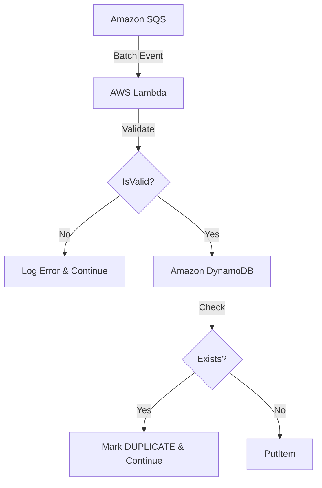

# Module 5 – DynamoDB Log Storage

## Objective
Extend the existing Log Processing Lambda to store validated JSON logs into Amazon DynamoDB using `boto3`.

## Architecture


## Data Model & Trade-offs
In the initial project foundation (Module 2), the DynamoDB table `LogStorageTable` was deployed with the following Key Schema:
* **Partition Key:** `service_name`
* **Sort Key:** `timestamp`

To strictly adhere to the rule of **NOT recreating existing deployed infrastructure**, we did not change the primary key to `request_id`. Instead:
1. `service_name` and `timestamp` remain the primary key combination.
2. `request_id` is stored as a normal attribute on the item.
3. **Trade-off:** If two exact same logs (same `service_name` and same `timestamp`) arrive with different `request_id`s, they would overwrite each other. However, since the generator guarantees uniqueness and millisecond precision timestamps, collisions are extremely rare.

## Duplicate Protection
We leverage DynamoDB's `ConditionExpression="attribute_not_exists(request_id)"`. This guarantees that if a log with the same primary key already exists and has a `request_id` attribute, DynamoDB throws a `ConditionalCheckFailedException`. The Lambda catches this, logs a structured `DUPLICATE` status, and continues seamlessly.

## Files Modified
* `backend/src/log_processor.py` (Added `boto3` logic, duplicate catching, and `STORED`/`DUPLICATE` structured statuses).
* `infrastructure/template.yaml` (Added `DYNAMODB_TABLE_NAME` environment variable).

## Files Created
* `backend/tests/test_dynamodb_storage.py` (Comprehensive tests mocking `boto3` for success, duplicates, and unhandled generic DynamoDB exceptions).

## Testing
`pytest` validates the robust error handling:
* Ensures `boto3.resource.Table.put_item` is called accurately.
* Simulates `ConditionalCheckFailedException` (Duplicate).
* Simulates generic `ClientError` (e.g. Throttling).
* Simulates mixed batches containing bad JSON, duplicates, and valid items, verifying the loop never crashes the batch.

## Deployment Instructions
1. `cd infrastructure`
2. `sam build`
3. `sam deploy`

## AWS Verification Steps
1. Run the log generator to send new logs:
   `python scripts/log_generator.py --url <YOUR_API_URL> --count 5`
2. Run AWS CLI to scan the table:
   ```bash
   aws dynamodb scan --table-name cloudpulse-logs-dev
   ```
3. Look for the `request_id`, `service_name`, `timestamp`, and `message` attributes in the returned JSON.

## Lessons Learned
Infrastructure-as-Code often forces pragmatic trade-offs. Changing a partition key of an active table requires recreating the table. By adapting the application code to fit the existing infrastructure schema, we avoided downtime and complex data migrations while still satisfying business rules via clever use of `ConditionExpression`.
