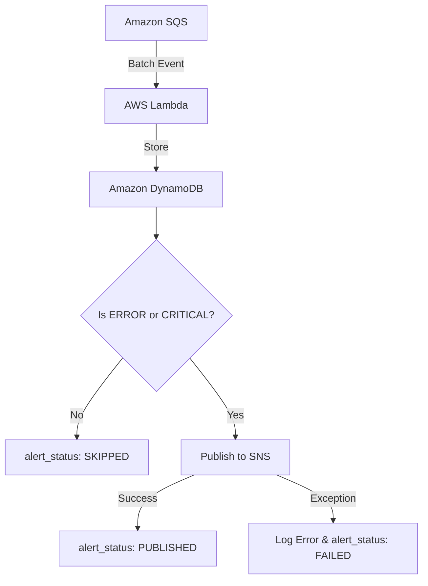

# Module 6 – SNS Alerting

## Objective
Implement alerting logic within the Log Processor Lambda to selectively publish high-severity logs (ERROR and CRITICAL) to an Amazon SNS topic, without causing batch interruptions on failure.

## Architecture


## Alert Flow
1. **Validation & Storage:** The log must pass structural validation and be stored in DynamoDB (duplicates skip the alert phase).
2. **Evaluation:** The Lambda checks the `level` field against `{"ERROR", "CRITICAL"}`.
3. **Publishing:** A curated JSON payload is published using the `boto3.client('sns')`.
4. **Isolation:** If SNS is unavailable or throws an exception, the Lambda swallows the exception, logs `alert_status: FAILED`, and seamlessly moves to the next record.

## SNS Payload
```json
{
  "request_id": "req-12345",
  "service_name": "payment-service",
  "level": "ERROR",
  "message": "Payment processing failed",
  "timestamp": "2026-07-22T10:30:00Z",
  "status": "ALERT_TRIGGERED"
}
```

## CloudWatch Verification
Check `/aws/lambda/cloudpulse-processor-dev` in CloudWatch for the structured JSON logs. Look for:
* `"alert_status": "PUBLISHED"` (for ERROR/CRITICAL)
* `"alert_status": "SKIPPED"` (for INFO/WARNING)
* `"alert_status": "FAILED"` and `"reason": "SNS publish error: ..."` (if there is an IAM or endpoint failure).

## Testing
`pytest` guarantees all logic pathways behave safely:
* **INFO/WARNING:** Never invoke SNS.
* **ERROR/CRITICAL:** Confirm the payload matches the strict required schema.
* **Mock SNS Failure:** Simulates boto3 throwing an exception and confirms the Lambda correctly handles the error instead of bubbling it up.
* **Mixed Batch Processing:** Verified that in a batch containing mixed valid logs and bad JSON, the appropriate logs are stored, and only the correctly leveled ones trigger SNS.

## Deployment
1. `cd infrastructure`
2. `sam build`
3. `sam deploy`

## Troubleshooting
* **Missing Alerts?** Check CloudWatch for `"alert_status": "FAILED"` to see if IAM permissions are missing. (Our `LogProcessorExecutionRole` already has `sns:Publish`).
* **Too Many Alerts?** Verify you aren't sending duplicates. The code skips alerting if `storage_status == "DUPLICATE"`.
