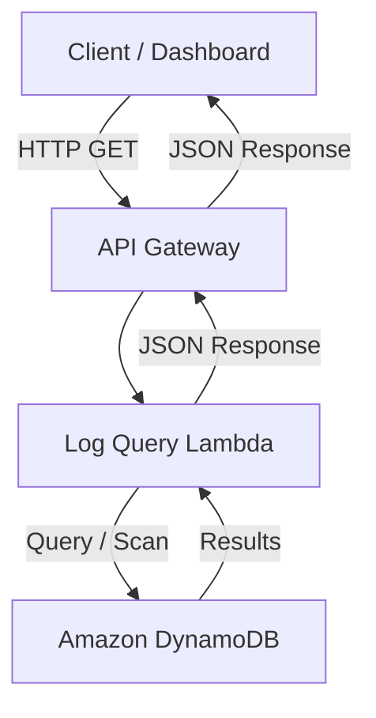

# Module 7 – Log Query API & Analytics

## Objective
Provide a serverless REST API to query and analyze logs stored in DynamoDB via API Gateway and Lambda.

## Architecture


## API Routes

### 1. Health Check
* **Endpoint:** `GET /health`
* **Purpose:** Validates the API is responsive.
* **Example Response:**
  ```json
  {
    "status": "healthy",
    "service": "CloudPulse"
  }
  ```

### 2. Get All Logs
* **Endpoint:** `GET /logs`
* **Query Parameters:** `limit` (Optional, 1-100, default: 20)
* **Example:** `GET /logs?limit=50`
* **Example Response:**
  ```json
  {
    "logs": [
      {
        "service_name": "payment-service",
        "timestamp": "2026-07-22T10:30:00Z",
        "level": "ERROR",
        "message": "Payment failed",
        "request_id": "req-123"
      }
    ]
  }
  ```

### 3. Get Logs by Service
* **Endpoint:** `GET /logs/service/{service_name}`
* **Query Parameters:** `limit` (Optional, 1-100, default: 20)
* **Example:** `GET /logs/service/payment-service`

### 4. Get Logs by Level
* **Endpoint:** `GET /logs/level/{level}`
* **Query Parameters:** `limit` (Optional, 1-100, default: 20)
* **Example:** `GET /logs/level/ERROR`

## Deployment
Deploy the updated stack to AWS:
```bash
cd infrastructure
sam build
sam deploy
```

## Troubleshooting
* **HTTP 500 Errors:** Check CloudWatch logs for `cloudpulse-query-dev` to see the underlying Python exception. It is deliberately suppressed from the API response for security.
* **HTTP 404:** Empty results trigger a 404 instead of a 200 with an empty list. This is expected behavior when no logs match the query.
