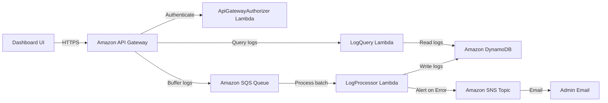

# Module 12: Production Readiness & Enterprise Hardening

## Overview
Module 12 is the final module for CloudPulse, focusing on transforming the serverless log ingestion and alerting application into an enterprise-hardened, production-ready system. We have separated environment configurations, restricted security permissions, optimized costs, and enhanced system recovery and documentation.

---

## Production Architecture

CloudPulse follows a serverless architecture designed for horizontal scalability, high availability, and least-privilege security access control:



---

## Deployment Guide

### Dev vs. Prod Deployment
By default, the environment is `dev`. To deploy to `prod`:
1. Use parameter overrides in your AWS SAM command:
   ```bash
   sam deploy --parameter-overrides Environment=prod AlertEmail=admin@company.com JwtSecret=YOUR_PROD_JWT_SECRET
   ```
2. In production mode, the CloudWatch log groups automatically scale up their retention policy to **90 days** (compared to 14 days in dev).
3. Production pipelines should always be triggered via GitHub Actions (`ci-cd.yml`) using protected branch branch protection rules.

---

## Security Checklist

- [x] **Least-Privilege Roles**: Custom IAM execution roles are assigned to all Lambda functions. No function has generic administrator privileges.
- [x] **Security Headers**: Standard API HTTP responses contain security headers (`X-Content-Type-Options: nosniff`, `X-Frame-Options: DENY`, `Strict-Transport-Security`, `Content-Security-Policy`, `Referrer-Policy`).
- [x] **CORS Constraints**: Restricts origin permissions and methods as required.
- [x] **Secure JWT Verification**: A custom authorizer intercepts queries. The cryptographic signature key (`JwtSecret`) is never hardcoded.

---

## Recovery Guide

In the event of a system failure or outage:

### 1. SQS Dead Letter Queue (DLQ) Recovery
- If the processor fails to parse logs three times, SQS moves them to `cloudpulse-logs-dlq-prod`.
- **Action**: Check LogProcessor's CloudWatch Logs for processing errors.
- **Redrive**: Once the error is fixed, use the AWS Console or AWS CLI to redrive messages from the DLQ back to the main queue:
  ```bash
  aws sqs start-message-move-task --source-arn <DLQ_ARN> --destination-arn <QUEUE_ARN>
  ```

### 2. DynamoDB Recovery
- DynamoDB Point-in-Time Recovery (PITR) should be enabled in production to allow restoring the table data to any second in the last 35 days.
  ```bash
  aws dynamodb update-continuous-backups --table-name cloudpulse-logs-prod --point-in-time-recovery-specification PointInTimeRecoveryEnabled=true
  ```

---

## Monitoring Guide

### CloudWatch Dashboard
A comprehensive monitoring dashboard (`CloudPulse-Dashboard-${Environment}`) is created automatically upon stack deployment. It monitors:
- Lambda Invocations, Errors, Average Durations, and Cold Starts.
- API Gateway latency, counts, and 4XX/5XX request errors.
- SQS Queue backlogs.
- SNS notifications.
- DynamoDB read/write capacity units.

### CloudWatch Alarms
Alarms automatically alert administrators if:
- SQS queue depths exceed 100 messages.
- Any message enters the SQS DLQ.
- Active authentication failures spikes over 5 failures/minute.
- Lambda execution times exceed 5 seconds.

---

## Scaling Strategy

1. **API Ingestion**: API Gateway to SQS integration runs natively at AWS scale. It supports thousands of concurrent requests without running cold lambda executions.
2. **Batch Processing**: The `LogProcessor` processes SQS logs in batches of 10. For high throughput, SQS concurrency scales up automatically up to the account's concurrent Lambda limit (default 1000).
3. **Database Scaling**: DynamoDB runs in `PAY_PER_REQUEST` billing mode, meaning read/write capacity scales up dynamically to handle any load, scaling back to zero during inactivity.

---

## Cost Optimization

- **Log Retention**: Restricting retention prevents infinite logging storage costs.
- **Scale-to-Zero Billing**: Pay-per-request DynamoDB and SQS ensure zero base costs when idle.
- **Optimized Lambda Sizing**: Adjusted memory allocations (e.g. `Login` reduced from 512MB to 256MB) directly reduces gigabyte-second pricing costs without affecting execution speeds.

---

## Maintenance Guide

1. **Dependency Upgrades**: Check Dependabot pull requests weekly for library and action updates.
2. **Secrets Rotation**: Periodically rotate `JwtSecret` parameter inputs using parameter store overrides.
3. **Local Auditing**: Regularly run:
   ```bash
   ruff check .
   black --check .
   pytest
   ```
